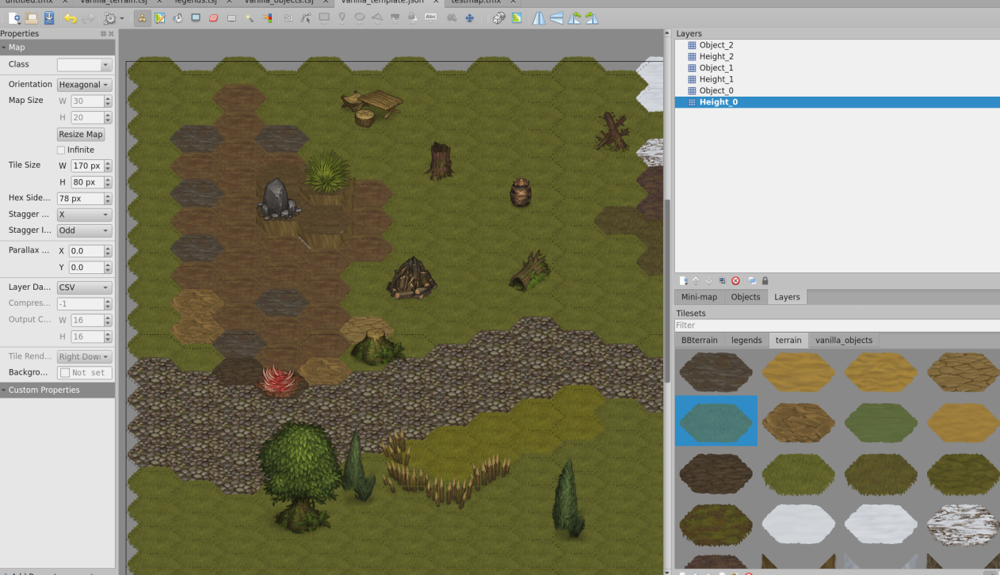
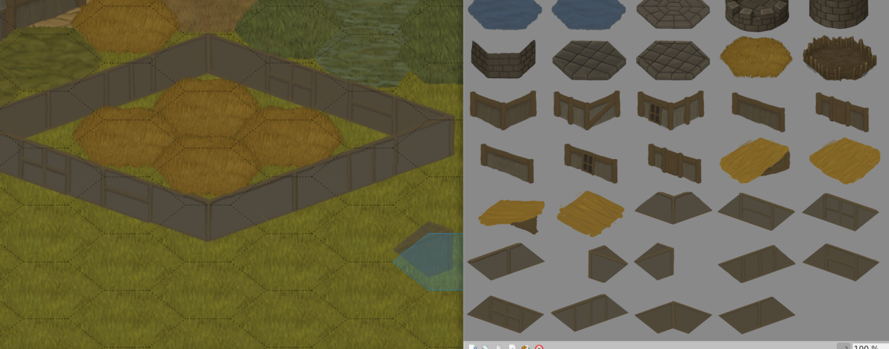
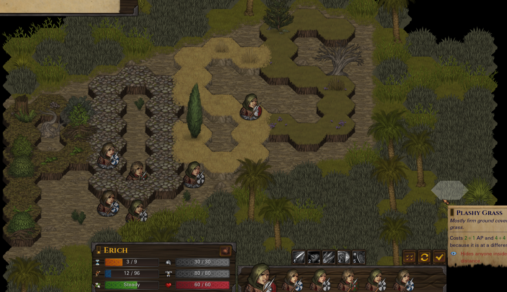

# BattleBrushes

Tiled plugin and tools for working with Battle Brothers `.brush` files. Enables UI based map and tileset editing workflows for BB modding without command line tools like `bbrusher.exe`. 

The maps can then be exported as .nut files and loaded via Legends custom maps folder which will autodiscover them and enable them for custom tactical battles 

The ability to save tilesets as brush files can enable simpler visual pathways for artists to get their art in game, though a full paperdoll interface is not yet provided.



*Editing Battle Brothers tactical maps in Tiled with terrain tiles and objects*

## What's Included

### Tiled Integration
- **C++ Plugin** (`tiled/src/plugins/brush/`) - Native `.brush` import in Tiled fork
- **Python Plugin** (`brush_tileset_plugin.py`) - Alternative for system Tiled installations
- **GUI Importer** (`create_brush_importer.py`) - Tkinter app for drag-and-drop workflow

### Conversion Tools
- **brush_to_tileset.py** - Convert `.brush` to Tiled `.tsx` tileset + extracted sprites
- **brush_to_tiled.sh** - Shell wrapper for brush conversion
- **tiled_to_nut.py** - Export Tiled hex maps to BB tactical template `.nut` files

### Analysis Tools
- **brush_analyzer.py** - Analyze `.brush` file structure and sprite records
- **brush_format.py** - Brush format parsing library
- **find_all_sprites.py** - Extract sprite metadata from brush files

### Build Scripts
- **compile_brush_plugin.sh** - Build the C++ plugin using QBS
- **build_for_system_tiled.sh** - Build plugin for system Tiled installation
- **build_and_test.sh** - Full build and validation pipeline
- **test_plugin_success.sh** - Verify plugin installation


## Quick Start

### Option 1: Use the Standalone Converter (No Build Required)

```bash
# Convert a brush file to Tiled format
python3 brush_to_tileset.py terrain.brush terrain.tsx

# This creates:
# - terrain.tsx (Tiled tileset)
# - terrain_sprites/ (extracted PNGs)
```

Then open `terrain.tsx` in Tiled.

### Option 2: GUI Importer

```bash
python3 create_brush_importer.py
```

Select a `.brush` file and it will convert and open in Tiled automatically.

### Option 3: Build the Native Plugin

```bash
# Initialize the Tiled submodule
git submodule update --init

# Build Tiled with the brush plugin
cd tiled
qbs build

# Run Tiled (can open .brush files directly)
./default/install-root/usr/local/bin/tiled
```

## Converting Tiled Maps to Battle Brothers



*Building structures with walls, roofs, and terrain objects*

Export Tiled hex maps as BB tactical templates:

```bash
python3 tiled_to_nut.py map.json Terrain.json \
    --name tactical.custom_map \
    --out tactical_custom_map.nut
```

### Map Layer Conventions

- Layer names `height 0`, `height 1`, etc. define elevation
- Terrain inferred from tileset image names (e.g., `grass_01` → `grass1`)
- Unknown tiles default to grass



*A custom tactical map running in-game*

## .brush File Format

Binary sprite atlas descriptor used by Battle Brothers:

| Field | Description |
|-------|-------------|
| Magic | `0xBAADFAAD` (little-endian) |
| Version | 17 (vanilla) |
| Sheet Path | Atlas PNG path (e.g., `gfx/terrain.png`) |
| Category | `terrain`, `detail`, `object`, or `entity` |
| Sprites | Paired records with metadata + UV coordinates |

See `BRUSH_IMPLEMENTATION_GUIDE.md` for full format documentation.

## Project Structure

```
├── tiled/                      # Tiled fork with brush plugin (submodule)
│   └── src/plugins/brush/      # C++ plugin source
├── examples/
│   ├── original_packed_brush_example/   # Vanilla brush files
│   ├── packed_mod_brush_example/        # Mod brush examples
│   └── unpacked_mod_brush_example/      # Extracted sprites
├── brush_to_tileset.py         # Brush → Tiled converter
├── tiled_to_nut.py             # Tiled → BB .nut converter
├── brush_analyzer.py           # Brush file analysis
├── create_brush_importer.py    # GUI importer app
└── BRUSH_IMPLEMENTATION_GUIDE.md
```

## Dependencies

- Python 3.8+ with Pillow (`pip install pillow`)
- Tiled 1.8+ (for using converted tilesets)
- Qt5 + QBS (only for building the native plugin)

## Known Issues

- Y-coordinate flip needed for some sprite types (BB uses bottom-left origin)
- Some brush categories have slightly different binary field ordering

## Related Projects

Part of the [Legends](https://www.nexusmods.com/battlebrothers/mods/60) mod tooling for Battle Brothers.

## License

Tools and plugin code provided for modding purposes. Battle Brothers assets remain property of Overhype Studios.
